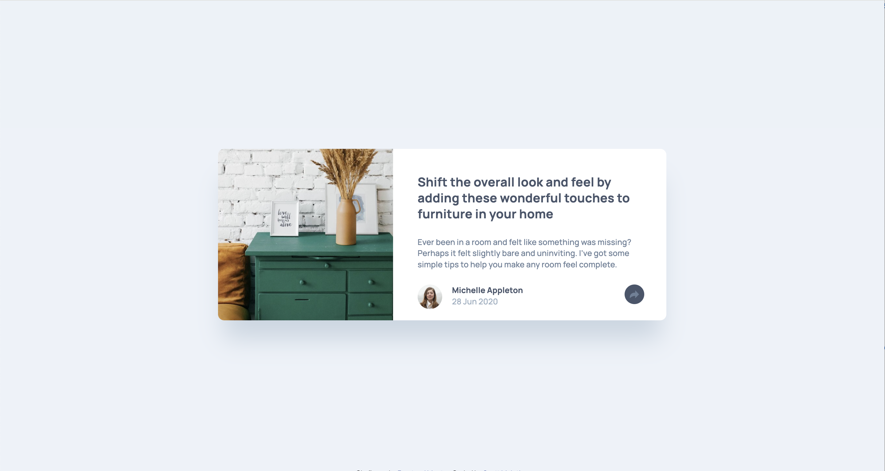

# Frontend Mentor - Article preview component solution

This is a solution to the [Article preview component challenge on Frontend Mentor](https://www.frontendmentor.io/challenges/article-preview-component-dYBN_pYFT). Frontend Mentor challenges help you improve your coding skills by building realistic projects.

## Table of contents

- [Overview](#overview)
  - [The challenge](#the-challenge)
  - [Screenshot](#screenshot)
  - [Links](#links)
- [My process](#my-process)
  - [Built with](#built-with)
  - [What I learned](#what-i-learned)
- [Author](#author)

## Overview

### The challenge

Users should be able to:

- View the optimal layout for the component depending on their device's screen size
- See the social media share links when they click the share icon

### Screenshot

### Links

- View Code: [Github](https://github.com/ldg/article-preview-component-master)
- Live Site: [Github Pages](https://ldg.github.io/article-preview-component-master/)

## My process

After downloading and reviewing the challenge files, I first set up my Sass environment, then linked the google fonts and my javascript in the header using the `defer` attribute in the script tag. I work mobile first to get all the main styles in place, updating styles for tablet, then desktop with media queries. Once the markup was in place, I started styling the component, working from the top to the bottom.

### Built with

- Semantic HTML5 markup
- CSS custom properties
- Flexbox
- CSS Grid
- Mobile-first workflow
- [Sass](https://sass-lang.com/) - For styles

### What I learned

One thing I learned while working on this was that I underestimated the importance of using consistent class names. I thought because this was simple component, I could kind of wing it on the class names. I found that later on in the challenge I was getting confused by my class names because they wheren't a clear as they could have been. I generally try to stick with BEM naming conventions but this time I didn't. I'm thinking specifically of the markup on the share pop-up. As I developed that feature I found myself adding additional markup which started getting confusing by the time I had it all worked out.

One other thing I tried with this challenge was using a Sass Mixin to write out utility classes for each of the text presets. I was happy to get it to work and I could see how doing this sort of thing could be very useful on future projects.

Lastly I struggled with finding a solution for managing the share popup, transitioning between the mobile view and then to the tablet / desktop view. When I got the initial popup to work on the mobile view, I wasn't sure how to transition to the tablet view. My solution for mobile was to add a second "close-share" button in the links container so the user could dismis the popup, while it was active and covering the original "share icon". I thought that maybe I'd need to write seperate javascript for each screen size. I thought the best path forward would be to move the javascript I'd written into a function, and create seperate functions for the tablet and desktop views.

After trying this out I realized it wouldn't be a workable solution because I needed to get the screen size first in order to distinguish the different viewports.

So instead I decided to stick with the simple javascript I'd written for the mobile view share popup, and rely on css media queries to manage the style changes between the different viewports.

## Author

- Frontend Mentor - [@yourusername](https://www.frontendmentor.io/profile/ldg)
